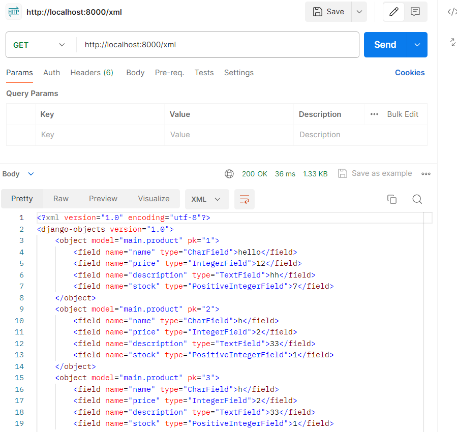
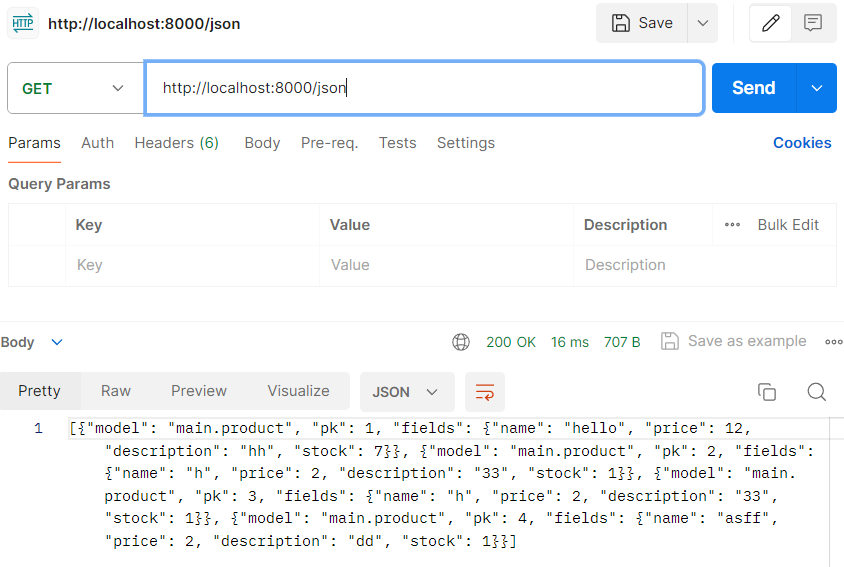
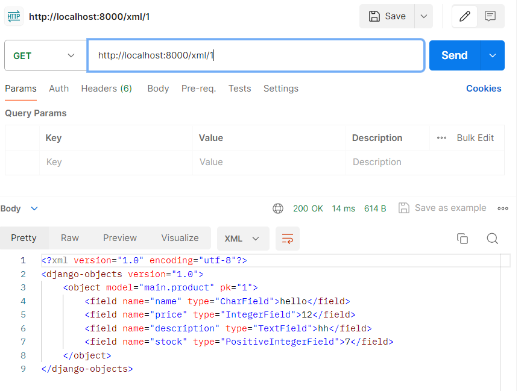
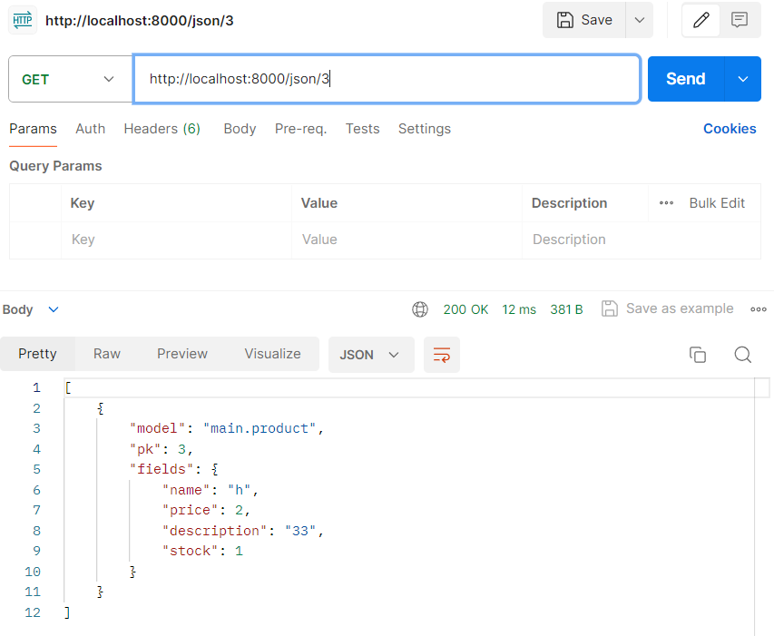

**PWS link to deployed application**
https://aleksey-panfilov-cornerstoreinventory.pbp.cs.ui.ac.id/

**Implementation of the project**
1. I started with creatinga folder for my corner store inventory webapp.
2. I created a virutal environment for my new project using the command
python -m venv env
3. I activated the venv using the command
env\Scripts\activate
4. I created a requirements.txt file in my corner-store-inventory folder with the following dependencies:
django
gunicorn
whitenoise
psycopg2-binary
requests
urllib3
5. I installed the dependencies using the command: 
pip install -r requirements.txt
6. I created a Django project using the command
django-admin startproject corner_store_inventory .
7. I added "localhost", "127.0.0.1" strings to ALLOWED_HOSTS in settings.py
8. I created a github repository named corner-store-inventory
9. I initiated a local directory corner-store-inventory as a Git repository and connected it to the remote repository
git init
git branch -M main
git remote add origin <URL_REPO>
10. I added a .gitignore file with the same setup as in the tutorial, and I pushed all my changes to the remote repository
11. I created an application with the name main in the project using the command:
python manage.py startapp main
12. I performed routing so that the application main can run by adding 'main' to the INSTALLED_APPS in settings.py
13. I created a new folder "templates" under main directory, and created file main.html
14. I created a model in the main app with the name Product with attributes name, price, description, and stock.
15. I created a function in main/views.py that accepts a HTTP request and returns the main view. The main view consists of an 
html template main.html and a dictionary context containing the app name, my name, and class.
16. I performed a model migration to change the database table structure according to model changes.
python manage.py makemigrations
python manage.py migrate
17. I filled in template/main.html with html code to display class name, my name, and class.
18. I performed routing so that the application main maps to the function in views.py by creating url.py in main directory and calling the show_main 
function from main.views when the corresponding URL '' is accessed. 
19. I added a URL route into corner_store_inventory/urls.py to direct requests for '' to the main view by adding path('', include('main.urls')) to the urlpatterns variable.
I also had to import include from django.urls
20. I performed add, commit, push to my local repository.
21. I performed deployment of the app on PWS by creating a new project on PWS, saving the project credentials and project command, opening settings.py and adding PWS 
deployment URL to ALLOWED_HOSTS. I then ran the 3 commands from PWS and logged in using the PWS credentials. I changed the PWS branch name and pushed the changes to PWS.

**Create a diagram that contains the request client to a Django-based web application and the response it gives, and explain the 
relationship between urls.py, views.py, models.py, and the html file**

In this diagram, --> means request to new file, and ==> means response to file call

[Request Client] --> [urls.py] --> [views.py] --> [models.py] ==> [views.py] --> [html file] 
==> [views.py] ==> urls.py ==> [Request Client]

urls.py maps url patterns to views.py for the app main, so that when a specific url is requested, urls.py directs the request to the relevant function in views.py
views.py processes requests that it receives from urls.py. It requests any relevant data models from models.py, provides any context for a template, and then renders a template with the context.
models.py defines data models for the app, and gives structure to interactions with the database. It returns the structured model to urls.py when requested.
html file defines the structure of the information that gets displayed to the user. It populates the html template with the context provided by views.py

**Explain the use of git in software development!**
Git is used for version control management in projects. Git tracks the changes to files over time, allowing for the user to revert to 
previous versions of the code in case a bug is introduced in the updated code. It is also really useful for collaboration between 
multiple users, since they are able to work on different part of the project simulatneously and update the remote version of the project
without cancelling out the other user's work.

**In your opinion, out of all the frameworks available, why is Django used as the starting point for learning software development?**
Django hides a lot of the tedious and advanced parts of web development, making it easy for a beginner to start coding an app right away 
without a lot of setup. It has a lot of advanced features that require in-depth learning to properly take advantage of them, however, a 
user without in-depth knowledge can still create apps and websites using django, which is why I think its used as a starting point for 
software development. Additionally, django is built on top of python, and python is a very widely used language, hence since a lot of 
computer science students already have some familiarity with python, it is easier to learn software development with django.

**Why is django model called ORM?**
ORM stands for Object-Relational Mapping. It is named that because it maps data between a relational database and an object-oriented 
language. It aligns the code with the database structures.

**Implementation of part 2**
1. I created file forms.py in the main directory, I imported Product model from main/models.py and I created a product entry form that allows to add a model object
2. I opened views.py and made a function that creates a form which automatically saves the data submitted to the form
3. I added product objects to the main view so that they display on the homepage
4. I added my product function to urlpatterns in main/urls.py
5. I created base.html in templates/ to ensure consistent design of my views, and I added  to main/templates/main.html
6. I made base.html detectable as a template file by changing the templates variable in settings.py
7. I created an html file named create_product_entry.html in main/templates that will act as the product entry form.
8. I added 2 imports to main/views.py in order to work with XML and JSON data easily
from django.http import HttpResponse
from django.core import serializers
9. I created 4 functions in main/views.py to display objects in XML, JSON, XML by ID, and JSON by ID formats
10. I imported my 4 functions into main/urls.py and added URL paths for each of them in urlpatterns.
11. I tested the project by running 
python manage.py runserver

**Explain why we need data delivery in implementing a platform.**
We need data delivery to ensure our platform can provide users with the information and services they need by securely and efficinetly saving, loading, storing, and processing data. 
Without data delivery, the lack of good data management and data processing would make the platform unreliable, cause security issues, and have other problems.

**In your opinion, which is better, XML or JSON? Why is JSON more popular than XML?**
In my opinion, writing JSON is less error prone than XML, because JSON doesn't require words for structuring the data, only symbols. 
Hence, I think JSON is better, because it is easier to avoid bugs that were caused by a typo. JSON is more popular than XML because the syntax, while being more readable, is also faster to generate. It is more lightweight than XML
and is native to Javascript apps.

**Explain the functional usage of is_valid() method in Django forms. Also explain why we need the method in forms.**
is_valid() method validates each field of the form, such as whether a required field is null or has the wrong datatype. It returns true or false depending on whether the data is valid. 
We need this method in forms because our form is meant to save data to our database. If there are errors in the data which is being saved to the database, we will get a lot of errors because the data does 
not meet the database requirements and cannot be saved. Having validation before saving to database allows the user to fix mistakes in form data sooner, and makes the webapp more efficient.

**Why do we need csrf_token when creating a form in Django? What could happen if we did not use csrf_token on a Django form? How could this be leveraged by an attacker?**
The csrf_token is used for the server to ensure that a request is sent by an authenticated user. If we did not use the csrf_token for the form, the server would not check whether the form data is being submitted by an authenticated user 
or by an attacker trying to put malicious data into the database. An attacker could levarege a user's authenticated session by submitting forms on their behalf that perform actions that will harm the user, such as transferring funds or 
changing account details, potentially leading to severe security breaches and data loss.

**Postman Screenshots**

